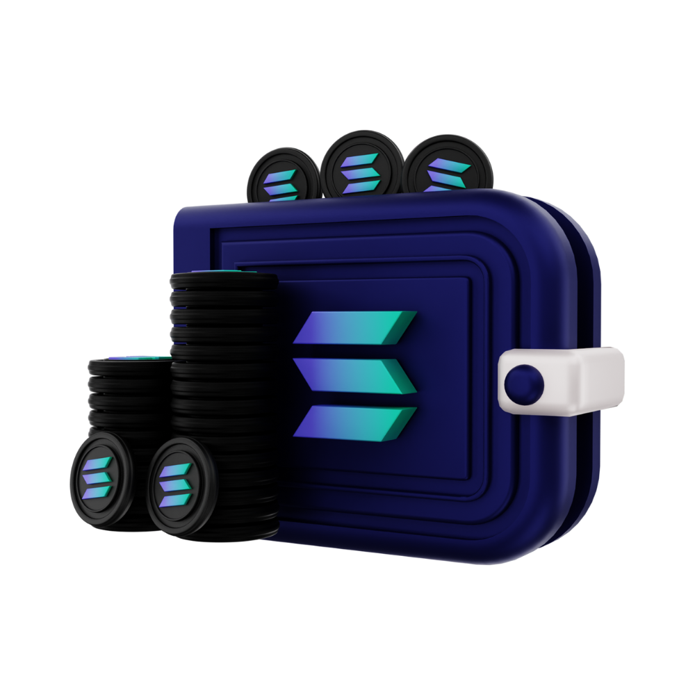
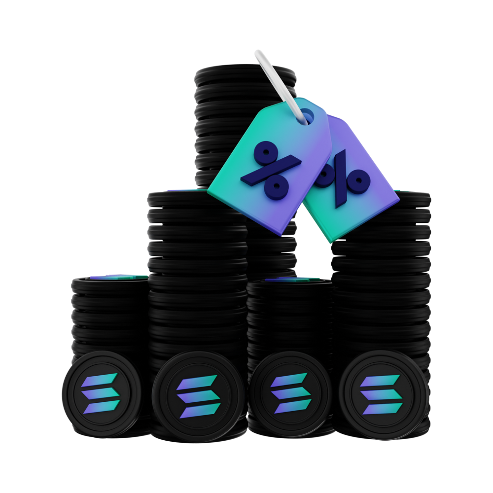
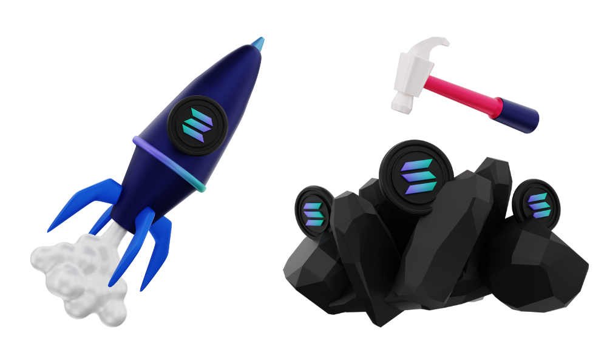

# 🌟 Lumen - Solana Payment Gateway

<div align="center">


**The Best Solana Payment Gateway**

[](https://github.com)
[](LICENSE)

</div>

---

## 📋 Table of Contents

- [About](#-about)
- [Features](#-features)
- [Project Structure](#-project-structure)
- [Images & Assets](#-images--assets)
- [Getting Started](#-getting-started)
- [Usage](#-usage)
- [Contributing](#-contributing)
- [License](#-license)

---

## 🎯 About

Lumen is a modern Solana payment gateway solution that provides seamless payment processing capabilities. This project offers a comprehensive web interface for managing payments, tokenomics, and exchange operations.

---

## ✨ Features

- 💳 **Accept Payments** - Easy payment processing
- 🔄 **Manage & Exchange** - Token management and exchange
- 📊 **Tokenomics** - Comprehensive token economics
- 📱 **Responsive Design** - Works on all devices
- 🎨 **Modern UI** - Beautiful and intuitive interface

---

## 📁 Project Structure

```
Lumen/
├── assets/
│   ├── logos/
│   │   ├── footer-logo.png
│   │   ├── header-logo.png
│   │   └── logonow.png
│   ├── Pics/
│   │   ├── About/
│   │   ├── AcceptPayments/
│   │   ├── Main/
│   │   ├── ManageandExchange/
│   │   └── Tokenomics/
│   └── Video/
│       └── token-video.mp4
├── public/
│   ├── *.html (Web pages)
│   ├── *.css (Stylesheets)
│   └── *.js (JavaScript files)
├── .github/
│   └── workflows/
│       └── auto-structure-repo.yml
└── scripts/
    └── generate-readme.py
```

---

## 🖼️ Images & Assets

### Logos

#### Footer Logo


#### Header Logo


#### Logonow


### Main Images

#### Lumen


### Gallery

#### About

**Achiev Img**


**Hiring Pic**


#### AcceptPayments

**Hero Img**


**Last Img**



#### Main

**Header Pic Example**


**Slider Phantom**


**Solflare**


#### ManageandExchange

**Contact Img**


**Hero Img**



**Last Img**


#### Tokenomics

**Token Img**



---

## 🚀 Getting Started

### Prerequisites

- A modern web browser
- A web server (optional, for local development)

### Installation

1. Clone the repository:
```bash
git clone https://github.com/yourusername/Lumen.git
cd Lumen
```

2. Open the project:
   - Simply open `public/index.html` in your web browser, or
   - Use a local web server for better experience

### Running Locally

You can use Python's built-in server:
```bash
cd public
python -m http.server 8000
```

Then open `http://localhost:8000` in your browser.

---

## 💻 Usage

1. Navigate to the main page (`public/index.html`)
2. Explore different sections:
   - **Home** - Main landing page
   - **About** - Learn about the project
   - **Accept Payments** - Payment processing
   - **Manage & Exchange** - Token management
   - **Tokenomics** - Token economics
   - **Documentation** - Project documentation

---

## 🤝 Contributing

Contributions are welcome! Please feel free to submit a Pull Request.

1. Fork the repository
2. Create your feature branch (`git checkout -b feature/AmazingFeature`)
3. Commit your changes (`git commit -m 'Add some AmazingFeature'`)
4. Push to the branch (`git push origin feature/AmazingFeature`)
5. Open a Pull Request

---

## 📄 License

This project is licensed under the MIT License - see the LICENSE file for details.

---

## 📞 Contact

For questions or support, please open an issue on GitHub.

---

<div align="center">

**Made with ❤️ by the Lumen Team**

⭐ Star this repo if you find it helpful!

</div>
